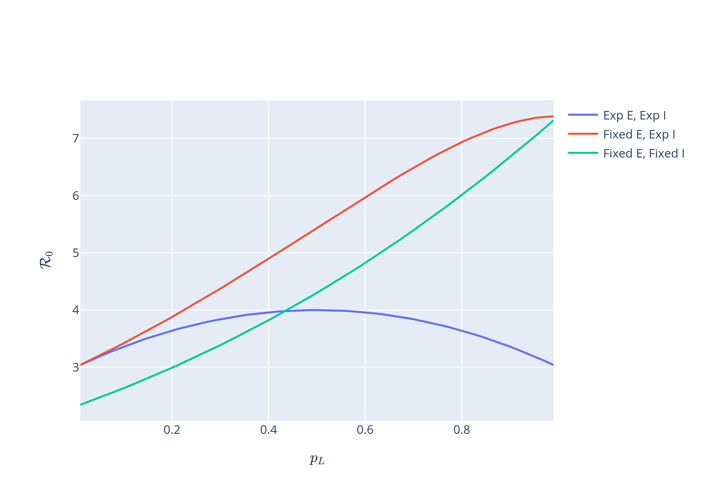
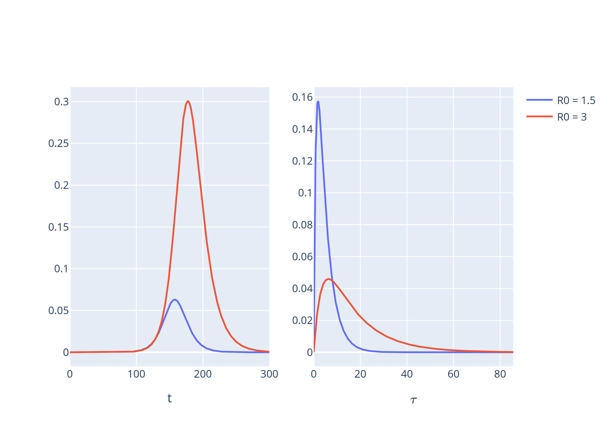
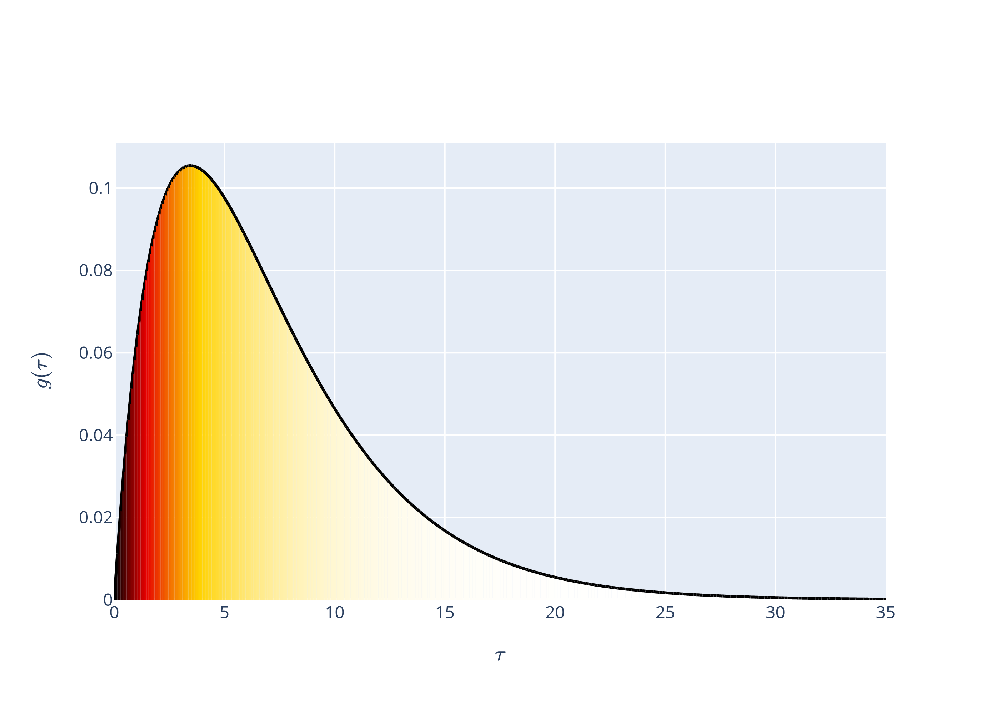
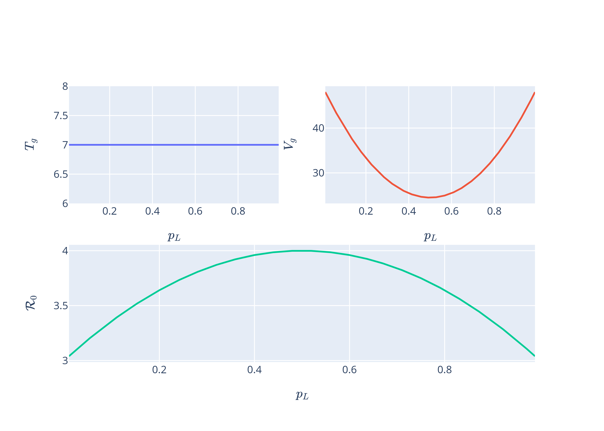
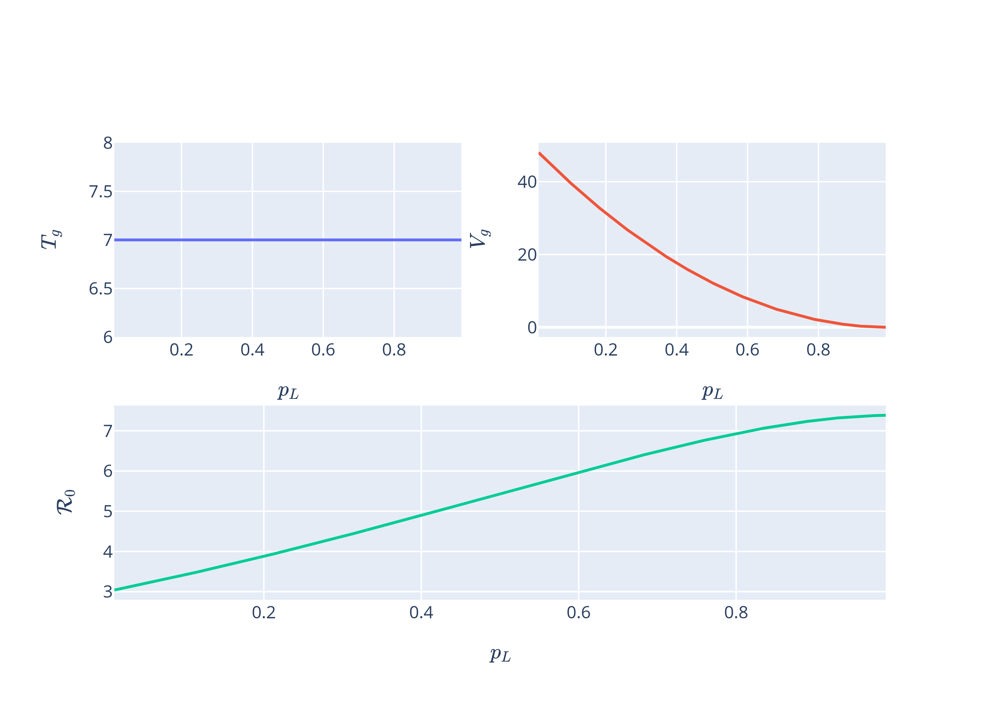
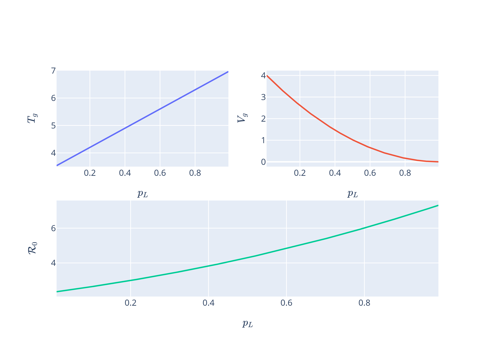

# PhD Project: Explore the effect of the latency period on estimates of the basic reproductive number obtained from exponential growth data

The raison d'être for this project was to explain a graph I saw in a paper [1] by Lorenzo Sadun. Sadun took the $R_0-r$ relations, that is the expressions estimate the basic reproductive number $R_0$ from the exponential growth rate in disease incidence $r$, of three different model and plotted them as a function of the latent period. He held the total amount of time that an individual was expected to spend infected constant but changed the proportion $p_L$ of it that was spent latent. The three models he looked at were a standard SEIR model (ExpExp) where both the latent period and infectious period were exponentially distributed, an SEIR model (FixExp) where the time spent in the latent period was fixed while the time spent in the infectious period was exponentially distributed and finally an SEIR model (FixFix) where the time spent in both the latent and infectious period were fixed. This resulted in what I considered an odd graph:



Why does the estimated $R_0$ for the ExpExp model rise until it hits a max and then wane while the other two models continue to rise? Is there a general principle here that can be ascertained? Thankfully there is and it is quite simple. The key insight is that as $p_L$ is altered, $r$ is held constant which means that a certain rate of exponential growth is assumed to have been produced. Two elements combine to produce a given rate of exponential rate: the total infectiousness and the rate at which that infectiousness is 'released'. Thus an epidemic with lower total infectiousness but a quick rate of release can produce the same level of exponential growth as one with higher total infectiousness but slow rate of release, as seen in the graph below



If we take a closer look at the $R_0-r$ relation, we see that the portion of a person's infectiousness that is released sooner is exponentially more influential that the portion that is released later.
 The generation-interval distribution $g(\tau)$ is the proportion of a persons infectiousness that occurs at age-of-infection $\tau$, that is $\tau$ time units after they were infected. The $R_0-r$ relation is thus given by 
```math
R_0 = \frac{1}{\bar{g}(r)}
```
where $\bar{g}(r) = \int_0^{\infty} e^{-r \tau}g(\tau) d \tau$. If we change $g(\tau)$ such we shift a person's infectiousness to occurring later, then $\bar{g}(r)$ quickly approaches zero. This implies that infectiousness that is shortly released after infection is substantially more influential on exponential growth as the diagram of $g(\tau)$ coloured by $e^{-r \tau}$ shows:



This fact allows us to derive two predictive rules when understanding how varying a parameter will affect the estimated value of $R_0$. Let $T_g$ and $V_g$ be the mean and variance of the generation-interval distribution. Then increasing $T_g$ will increase $R_0$ while increasing $V_g$ will reduce it. The first rule is intuitive: increasing $T_g$ shifts a persons infectiousness to later and thus the total infectiousness $R_0$ must increase if the same rate of exponential growth is to be produced. Increasing $V_g$ has a more complicated affect. As the variance increases, we would expect some proportion of a persons infectiousness to be released sooner while another portion to be released later. The former occurrence would result in downwards pressure on $R_0$ while the latter would have the opposite effect. Which will take precedence? As infectiousness that occurs sooner has a disproportionately large effect on $\bar{g}(r)$ due to the exponential damping term $e^{-r \tau}$, shifting some of the distribution $g$ closer to $\tau = 0$ will be the prime effect and thus lead to a smaller $R_0$ as the total infectiousness must decrease to balance the faster transmission. 

Armed with this, we can now explain what is happening with the estimates of $R_0$ for the three different models as $p_L$ is varied. For the ExpExp, the analysis is easy. $T_g$ isn't affected by $p_L$ and thus $R_0$ is completely controlled by the variance:



The same is true for the FixExp model:



In the FixFix model, $T_g$ increases with $p_L$ while $V_g$ decreases, both of which inflate $R_0$:



I extended this project to an $S E^m I^nR$ model where the times spent in the latent and infectious compartments were Erlang distributed. An interesting results was that increasing $n$ wasn't as influential as it lead to a smaller $T_g$ but also a smaller $V_g$, which had counteracting effects on $R_0$. 

## References
[1] Effects of Latency on Estimates of the COVID-19 Replication Number - Lorenzo Sadun - DOI: 10.1007/s11538-020-00791-2
